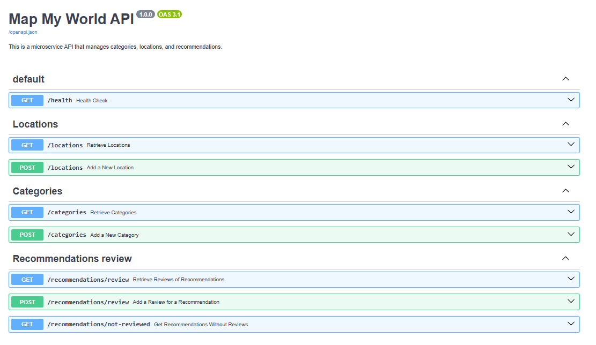

# API Map My World

Este proyecto proporciona una API para gestionar ubicaciones, categorías y recomendaciones. Utiliza FastAPI, SQLAlchemy y Alembic para la gestión de la base de datos, y Docker para la ejecución y despliegue.

## Arquitectura DDD

El código se divide en varias capas, cada una con una responsabilidad específica:

- **Application**: Contiene la lógica de aplicación, como los casos de uso para crear y obtener datos.
- **Domain**: Define las entidades y los esquemas del dominio y contiene las reglas de negocio esenciales.
- **Infrastructure**: Gestiona las interacciones con la base de datos, incluyendo modelos, repositorios y configuraciones de conexión.
- **Interfaces**: Define los puntos de entrada a la aplicación, como los endpoints de la API en FastAPI.

Cada capa interactúa con las demás a través de interfaces bien definidas, lo que permite una separación clara de responsabilidades.

## Requisitos Previos

- Docker
- Docker Compose
- Python 3.x (opcional, si prefieres ejecutarlo sin Docker)

## Configuración de la Base de Datos

Este proyecto utiliza **PostgreSQL** como base de datos. La configuración de conexión se define en el archivo `.env` que contiene las credenciales de acceso, nombre de la base de datos y otros detalles de configuración.

**Para configurar el archivo `.env`:**

1. Crea un nuevo archivo llamado `.env` en la raíz del proyecto.
2. Copia el contenido de `.env.template` en el archivo `.env`.
3. Ajusta los valores según tus configuraciones de entorno.


## Instalación

### Iniciar el Contenedor

Para iniciar el contenedor y construir la aplicación, ejecuta el siguiente comando en tu terminal:

```bash
docker-compose up -d --build
```

Este comando descargará las imágenes necesarias (si aún no están presentes), construirá el contenedor y lo ejecutará en segundo plano (-d).

## Ejecutar Migraciones

Una vez que el contenedor esté en ejecución, ejecuta las migraciones de Alembic para crear las tablas en la base de datos:

```bash
docker-compose exec web alembic upgrade head
```

Este comando aplicará las migraciones a la base de datos y asegurará que esté actualizada con los últimos cambios de esquema.

## Documentación
La documentación interactiva de la API está disponible mediante Swagger UI. Para acceder a ella, abre tu navegador y dirígete a la siguiente URL:

http://localhost:8000/docs#/



Aquí puedes ver todos los endpoints disponibles, con descripciones y la capacidad de probarlos directamente desde la interfaz.

## Endpoints Principales
* **GET** `/locations`: Obtener una lista de todas las ubicaciones.
* **POST** `/locations`:  Crear una nueva ubicación.
* **GET** `/categories`: Obtener una lista de todas las categorías.
* **POST** `/categories`:Crear una nueva categoría.
* **GET** `/recommendations/review`: Obtener las recomendaciones que han sido revisadas.
* **POST** `/recommendations/review`: Agregar una nueva revisión de recomendación.
* **GET** `/recommendations/not-reviewed`: Obtener combinaciones de recomendaciones que no han sido revisadas.

## Uso de los Endpoints

### Endpoints de Ubicaciones

#### Crear una locación

Este endpoint permite crear una nueva locación proporcionando un nombre, latitud y longitud.

**URL**: `POST /locations/`

**Ejemplo de solicitud**:

```bash
curl --location 'http://localhost:8000/locations/' \
--header 'Content-Type: application/json' \
--data '{
    "name": "Parque Nacional de los Picos de Europa",
    "latitude": 43.185698,
    "longitude": -4.891829
}'
```

**Ejemplo de respuesta:**:
```bash
{
    "id": 10,
    "name": "Parque Nacional de los Picos de Europa",
    "latitude": 43.185698,
    "longitude": -4.891829,
    "created_at": "2024-11-11T13:17:32.680463"
}
```

#### Obtener todas las locaciones
Este endpoint devuelve una lista de todas las locaciones almacenadas.

**URL**: `GET /locations/`

**Ejemplo de solicitud**:
```bash
curl --location 'http://localhost:8000/locations'
```

**Ejemplo de respuesta:**:
```bash
[
     {
        "id": 8,
        "name": "Casa Batlló",
        "latitude": 41.391648,
        "longitude": 2.165711,
        "created_at": "2024-11-11T13:17:17.963977"
    },
    {
        "id": 9,
        "name": "Catedral de Santiago de Compostela",
        "latitude": 42.879658,
        "longitude": -8.544015,
        "created_at": "2024-11-11T13:17:25.551094"
    },
    {
        "id": 10,
        "name": "Parque Nacional de los Picos de Europa",
        "latitude": 43.185698,
        "longitude": -4.891829,
        "created_at": "2024-11-11T13:17:32.680463"
    }
]
```

### Endpoints de Categorias

#### Crear una categoría

Este endpoint permite crear una nueva categoría proporcionando un nombre.

**URL**: `POST /categories`

**Ejemplo de solicitud**:

```bash
curl --location 'http://localhost:8000/categories' \
--header 'Content-Type: application/json' \
--data '{
    "name": "Monuments"
}'
```

**Ejemplo de respuesta:**:
```bash
{
    "id": 3,
    "name": "Monuments",
    "created_at": "2024-11-11T13:24:52.463382"
}
```

#### Obtener todas las categorías

Este endpoint permite obtener una lista de todas las categorías disponibles.

**URL**: `GET /categories`

**Ejemplo de solicitud**:

```bash
curl --location --request GET 'http://localhost:8000/categories' \
--header 'Content-Type: application/json'
```

**Ejemplo de respuesta:**:
```bash
[
    {
        "id": 1,
        "name": "Historical Sites",
        "created_at": "2024-11-11T13:24:31.993070"
    },
    {
        "id": 2,
        "name": "Museums",
        "created_at": "2024-11-11T13:24:38.513792"
    },
    {
        "id": 3,
        "name": "Monuments",
        "created_at": "2024-11-11T13:24:52.463382"
    }
]'
```